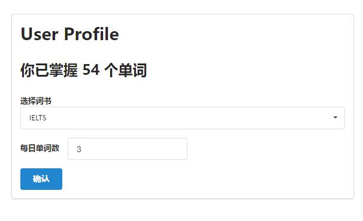
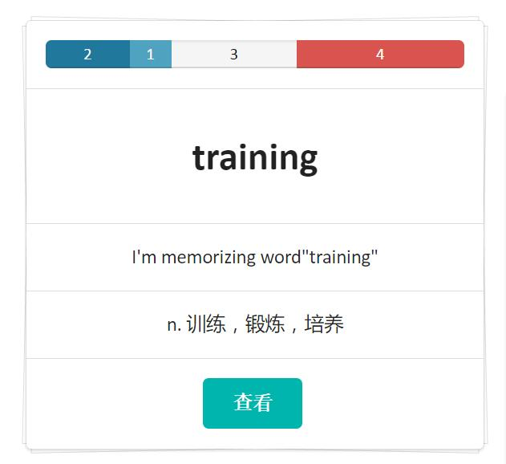

# SWord

 [](https://www.stdioa.com/)

## Subject
扇贝小作业——简易背单词应用。

要求：  
1. 用户可以根据自己的英语水平，例如 四级，六级，雅思，和托福 来设置自己背单词的范围；  
2. 每个用户可以设置每天背多少单词；  
3. 用户背单词过程中能够添加笔记， 也可以查看其他用户共享的笔记；    
4. 用户背单词过程中，可以看到单词，单词的解释和例句。

Requirements:
> Django==1.9.1  
> whitenoise==3.0

## Visit it Online
<http://word.stdioa.com/>

## Snapshots




## How to Run

### 0. 安装依赖
`pip install -r requirements.txt`

### 1. django全局设置
`export DJANGO_SETTINGS_MODULE=SWord.settings-dev`

### 2. 初始化数据库
`python manage.py migrate`

### 3. 建立超级用户
`python manage.py createsuperuser`

### 4. 启动应用
`python manage.py runserver 0.0.0.0:8001`

### 5. 添加词书及user用户
用超级用户登录 http://localhost:8001/admin/ 添加词书及user用户


> * 由于没有编写单词、词书及笔记添加的接口，以下脚本用于在 `django shell` 中自动添加单词及笔记

### 6. 添加单词并为单词随机选择词书
`python manage.py shell`
```python
from scripts.add_words import add_word, make_vocabulary
# 从词库中添加单词
add_word()
# 为单词随机选择词书
make_vocabulary()
```

### 7. 为单词添加笔记
```python
from scripts.add_note import add_note()
# 添加笔记
# 前提条件：存在用户名为 user 的用户
add_note()
```
